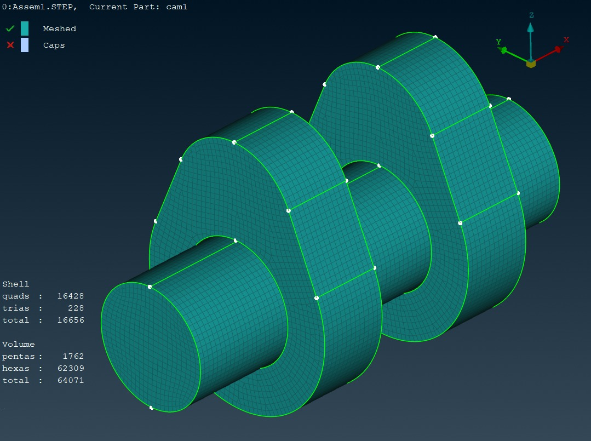
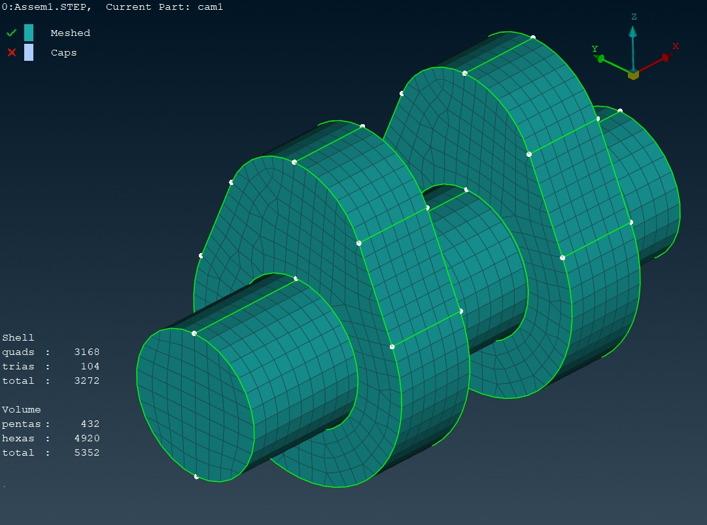
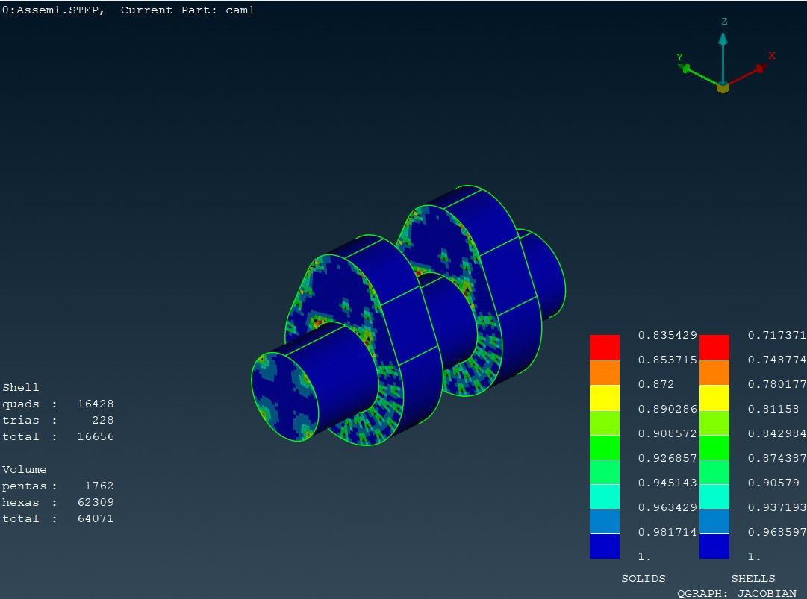
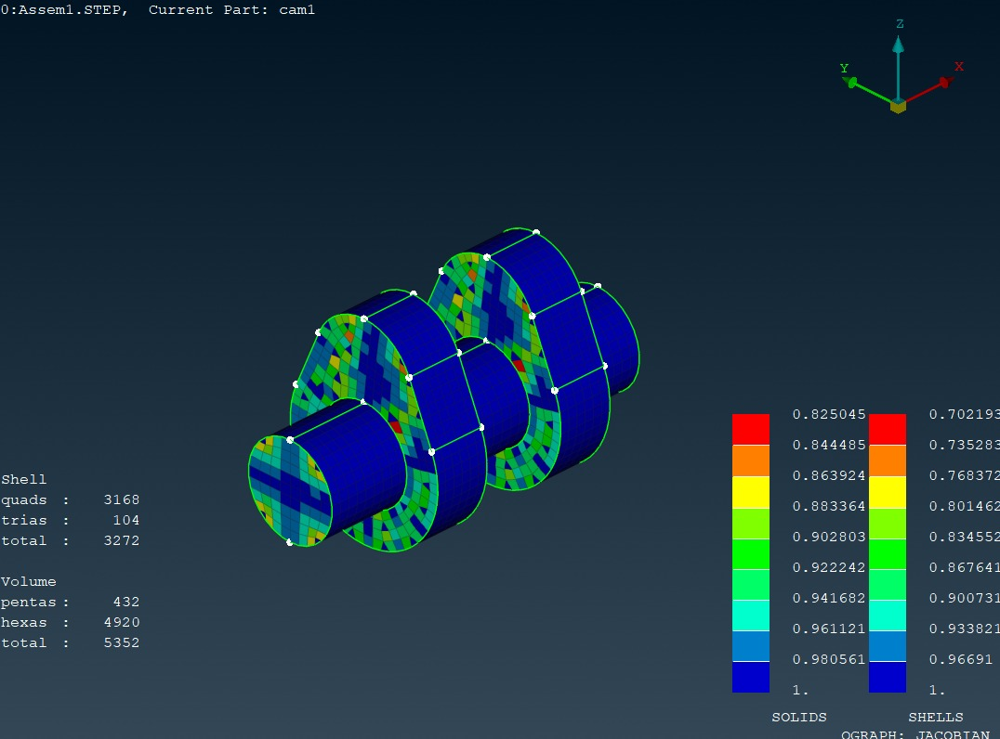
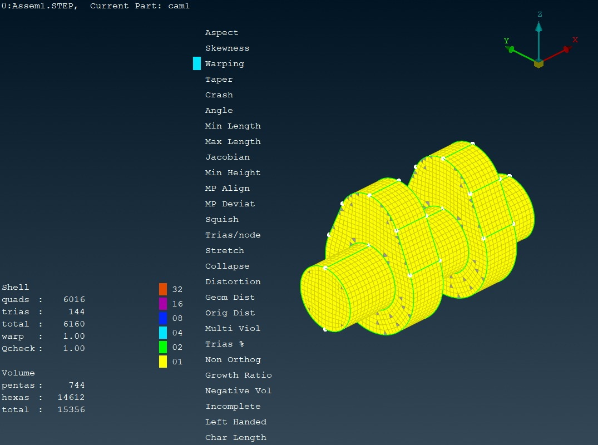
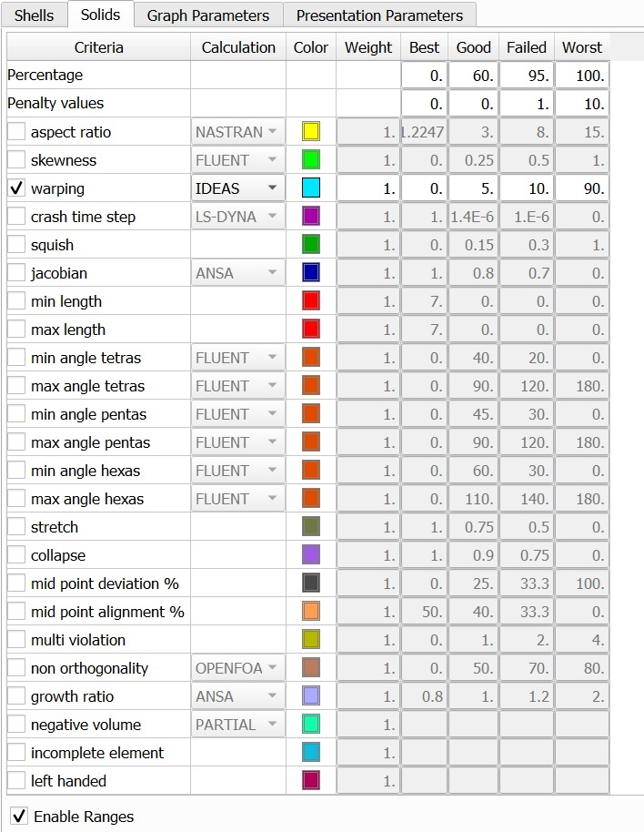
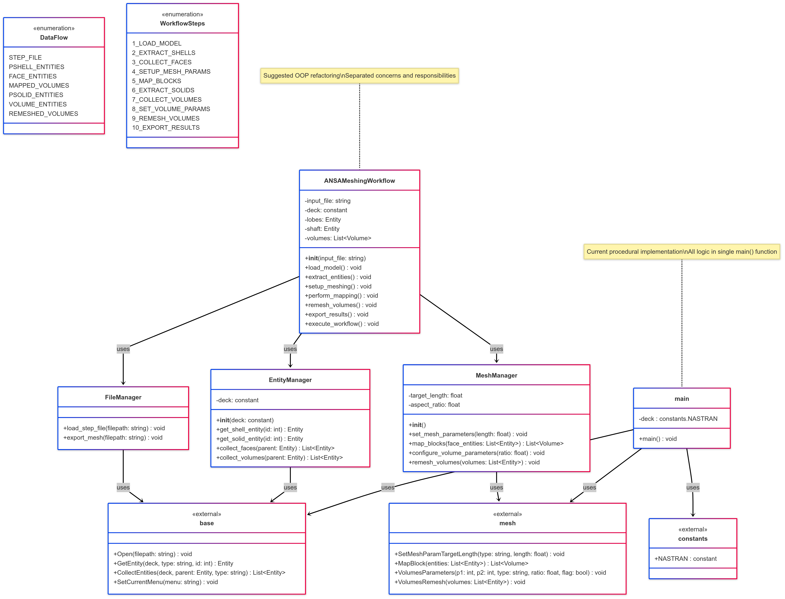

# ANSA Automated Meshing Workflow

Python script that scripts ANSA's meshing API to batch-mesh a camshaft at three element sizes and export ANSYS CDB decks, instead of doing it by hand in the GUI three times.


The part: a two-lobe camshaft on a shaft, imported from STEP.

## Overview

This came out of an Aerospace Structures EL (RVCE, AS244AI, 2024-25) where the task was to mesh a two-lobe camshaft at 3, 5, and 7 mm and report quality metrics for each. Re-running the same sequence of GUI clicks for every mesh size (and every time the CAD changed) was slow and error-prone, so the workflow got wrapped into a script that drives ANSA's Python API (`ansa.base`, `ansa.mesh`, `ansa.constants`) directly.

One object (`MeshProcessor`), one config dict, one `main(mesh_size)` call per target size. It imports the STEP geometry, maps the shell faces, fills the volumes with hex elements, applies quality control, and exports a NASTRAN-deck-compatible ANSYS CDB file. All three sizes (3 / 5 / 7 mm) run from a single script invocation with full logging, so a failed size doesn't take down the ones that succeeded.

## How it works

The part is a camshaft: two cam lobes plus a shaft, imported from `CAM_SHAFT.STEP`. The mesh is built property-by-property:

1. **Shell meshing** — pulls PSHELL 1 (lobe faces, 18 surfaces) and PSHELL 2 (shaft faces, 4 surfaces), then runs `mesh.MapBlock()` on each to get a structured quad mesh.
2. **Volume meshing** — pulls PSOLID 3/4/5 (lob1, lob2, shaft1), collects the associated volumes, and runs `mesh.VolumesRemesh()` with quality criterion 3 (aspect ratio), target quality level 2 ("good"), NASTRAN aspect as the solver metric, and a hard cap of 2.3 max aspect ratio with strict enforcement on.
3. **Export** — `base.OutputAnsys()` writes an ANSYS CDB file per mesh size (`meshsize3.0.cdb`, `meshsize5.0.cdb`, `meshsize7.0.cdb`).

Every step is logged to a timestamped file (`ansa_mesh_log.txt`) — geometry import, entity counts, quality parameters, timing per mesh size, and a final success/failure summary across all sizes. The config (STEP path, output dir, property IDs, quality thresholds, target sizes) lives in one block at the bottom of the script under `if __name__ == '__main__':`, so changing geometry or target sizes doesn't mean editing the class logic.

```
STEP file → shell faces (MapBlock) → solid volumes (VolumesRemesh, quality-controlled) → CDB export
```

## Repository layout

```
Required Files/
  export_working_long_code.py   the actual script (runs inside ANSA's embedded Python)
  CAM_SHAFT.STEP                 input geometry
Mesh/
  meshsize3.0.cdb / 5.0 / 7.0    exported ANSYS CDB decks
Log File/
  ansa_mesh_log.txt              full run log from the 1 July 2025 batch
Report/
  main.tex, Structures Lab SEE Report.pdf
  images/                        figures cited by the LaTeX report
images/quality_checks/           raw quality-plot exports (aspect ratio, Jacobian, skewness, warpage) at each mesh size
```

## Installation / Usage

This runs inside ANSA's embedded Python interpreter, not a standalone environment. You need ANSA (BETA CAE Systems) installed and licensed, there's no way around that dependency since the script calls `ansa.base` / `ansa.mesh` / `ansa.constants` directly.

1. Open the script in ANSA's script manager, or run it through ANSA's Python console.
2. Edit the config block at the bottom of `export_working_long_code.py`: `LOGGING_CONFIG` (log path), `PATHS_CONFIG` (STEP input path, output directory), `PROPERTY_CONFIG` (PSHELL/PSOLID IDs, these are model-specific and will need updating for a different geometry), `MESH_CONFIG` (sizing mode, quality thresholds), and `TARGET_MESH_SIZES`.
3. Run. Each target size gets meshed, quality-checked, exported, and logged in sequence, a failure on one size doesn't stop the others.

## Results

Batch run on 1 July 2025, single script invocation, three sizes:

| Size | Mesh + export time | CDB size | Solid elements | Hex share |
|---|---|---|---|---|
| 3.0 mm | 5.97 s | 18.85 MB | 64,071 | 97.3% |
| 5.0 mm | 2.89 s | 4.89 MB | 15,356 | 95.2% |
| 7.0 mm | 2.48 s | 1.90 MB | 5,352 | 91.9% |

Quality envelopes stayed inside the NASTRAN/ANSA targets across all three sizes: aspect ratio 1.02-1.85, Jacobian 0.825-1.00 (down to 0.717 on a few high-curvature shell elements at 3 mm), skewness 0.003-0.477, warpage 0.003-0.430, no inverted elements. A later CAM_SHAFT deck used for the report's quality overlay hit 98.9% hexahedra (29,020 hex / 29,352 solids).

**Mesh density across sizes:**

  

3 mm (64,071 solids), 5 mm (15,356 solids), 7 mm (5,352 solids), left to right. Coarsening is visible mainly on the lobe faces, the shaft stays structured at all three.

**Jacobian quality, 3 mm vs 7 mm:**

 

Jacobian stays close to 1.0 at both extremes of mesh density, the coarser 7 mm mesh doesn't lose element quality, it just has fewer elements.

**Aspect ratio, 5 mm vs 7 mm:**

 

Aspect ratio stays in 1.02-1.85 across sizes, red (worst-case elements) confined to a handful of high-curvature lobe-face elements, never the bulk of the mesh.

**Warpage, 5 mm vs 7 mm:**

 



Quality check table from the report's overlay run: 29,020 hex, 332 penta.



Suggested class split (`FileManager` / `EntityManager` / `MeshManager`) versus the single `main()` the live script actually uses.

## Limitations

This is a single-geometry EL report script, not a general-purpose mesher. The PSHELL/PSOLID property IDs, the two-region (lobe + shaft) split, and the quality thresholds are all tuned to this specific camshaft — a different part means re-identifying property IDs and probably rewriting the entity-collection logic. There's no CLI or argument parsing; everything is edited in the config block.

## References

Full write-up: [`ansa.html`](https://aboutkvs.vercel.app/ansa.html) on the portfolio site. Detailed report with methodology and full quality tables: `Report/Structures Lab SEE Report.pdf`.
